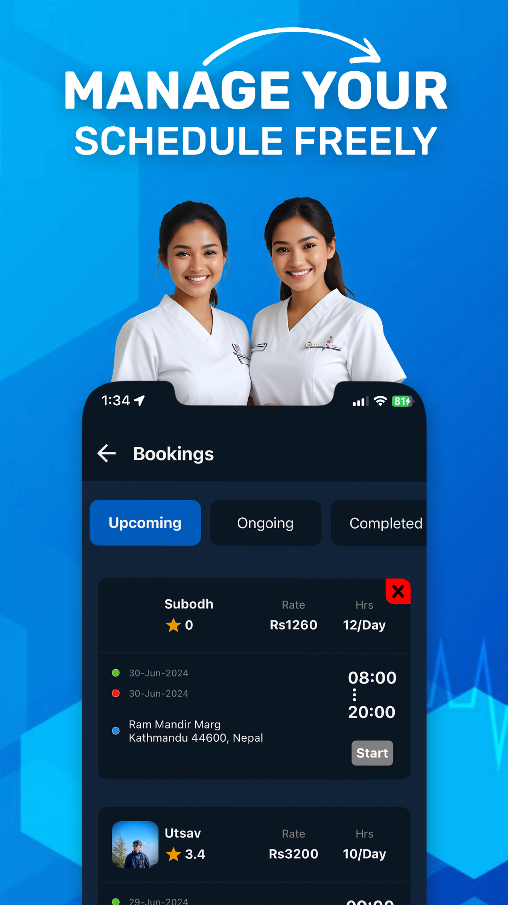
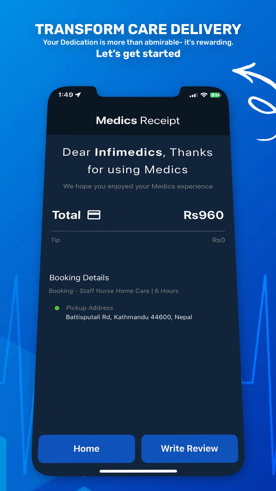
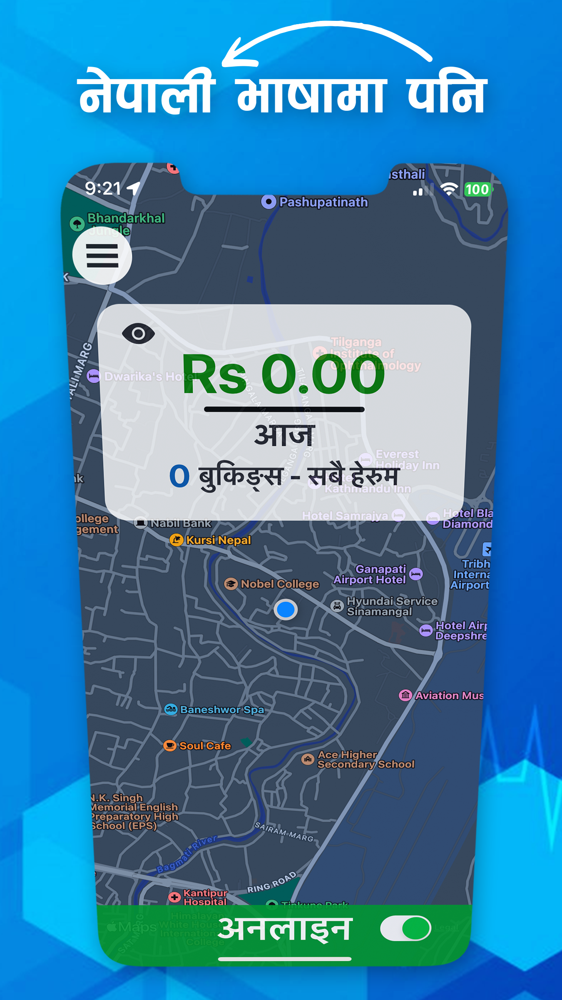

# **Medics Staff — React Native App**

**Medics Staff** is the companion application to the Medics Home platform, designed specifically for **caregivers and staff nurses**.
This app enables medical professionals to receive job requests from patients, manage their schedules, update their availability, and deliver home care efficiently.

---

## **Features**

### **Receive & Manage Job Requests**

* View incoming hiring requests from patients or family members
* Accept or decline jobs in real-time
* View job details including patient info, location, and care requirements
* Automatic notifications for new requests

### **Work Status & Availability**

* Toggle online/offline status
* Update availability for shifts
* Track ongoing and completed jobs

### **Navigation & Real-Time Tracking**

* See patient location on the map
* In-progress job tracking
* Route assistance for easier travel

### **Health Record Updates**

* Enter vitals and observations
* Maintain care notes
* Sync patient updates with the main Medics Home system

### **Secure & Reliable**

* Authentication via Medics staff accounts
* Smooth UI designed for medical professionals
* Ensures safe communication between staff, patients, and backend

---

## **Tech Stack**

**Frontend**

* React Native (TypeScript)
* React Navigation
* Firebase Realtime Database
* Axios
* Maps SDK (Google Maps / Apple Maps)

**Backend (Connected Service)**

* Laravel REST API
* MySQL Database

---

## **Setup Instructions**

### **1. Clone the repository**

```bash
git clone https://github.com/YOUR_USERNAME/medics-staff.git
cd medics-staff
```

### **2. Install dependencies**

```bash
npm install
```

### **3. Start the Metro bundler**

```bash
npm start
```

### **4. Run on Android**

```bash
npm run android
```

### **5. Run on iOS**

```bash
npm run ios
```

> Note: Your Firebase configuration, `.env` file, API URLs, and signing keys must be added manually.
> These files are excluded from the repository for security reasons.

---

## **Folder Structure**

```
medics-staff/
│── src/
│   ├── assets/
│   ├── views/
│   ├── config/
│   ├── reducers/
│   ├── actions/
│   └── components/
│── android/
│── ios/
│── assets/
│── .gitignore
│── package.json
│── app.json
│── README.md
```

---

## **Screenshots**

```
/assets/screenshots/
 - dashboard.png
 - job-request.png
 - job-details.png
 - availability.png
 - tracking.png
```

---

## **Security Notes**

This repo **excludes**:

* API keys
* Environment variables (`.env`)
* Firebase configuration files
* Keystore or signing files
* Production-level credentials

These must be manually added by anyone who forks the project.

---

## **License**

Released under the **MIT License** — allowing personal and commercial use.

---

## **Support**

If you find this project helpful, consider starring ⭐ the repository!
It helps showcase your work and supports open-source development.

---

## **Mockups**

<p align="center">
  
  
  
  
  
  
</p>

